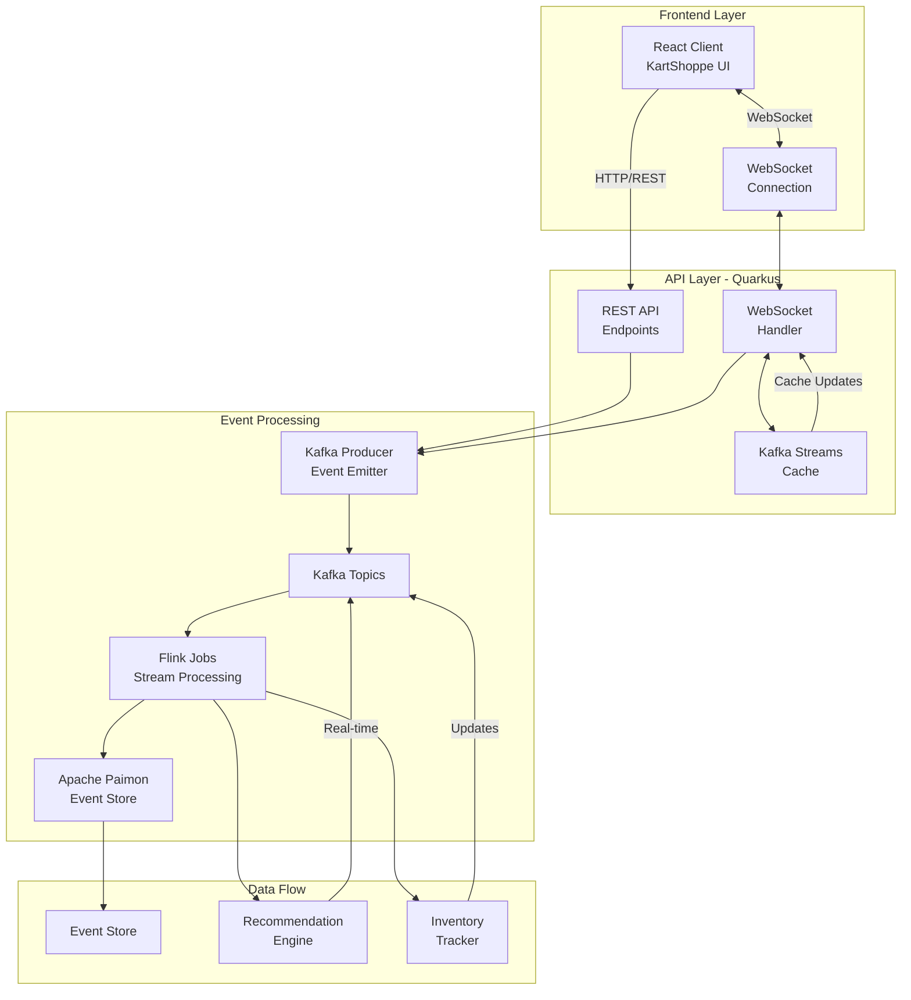
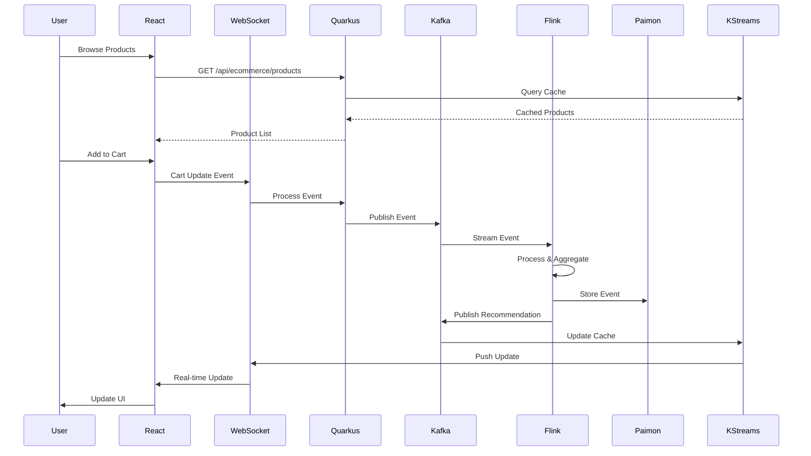

# KartShoppe - Real-time E-commerce Platform

## Overview

KartShoppe is a demonstration e-commerce platform built with **Event Sourcing** and **CQRS** patterns, showcasing real-time data processing with Apache Flink, Kafka Streams, and Apache Paimon.

## Architecture



## Event Flow Diagram



## Key Technologies

### Frontend
- **React 18** with TypeScript
- **Tailwind CSS** for styling
- **WebSocket** for real-time updates
- **Event Tracking** for analytics

### Backend
- **Quarkus** - Supersonic Subatomic Java
- **Kafka Streams** - Stream processing and caching
- **REST API** - Product catalog and orders
- **WebSocket API** - Real-time bidirectional communication

### Event Processing
- **Apache Kafka** - Event streaming platform
- **Apache Flink** - Stream processing engine
- **Apache Paimon** - Lake storage for event sourcing
- **CQRS Pattern** - Command Query Responsibility Segregation

## Event Types

### User Events
```json
{
  "eventType": "PRODUCT_VIEW",
  "sessionId": "session_123",
  "userId": "user_456",
  "productId": "prod_789",
  "timestamp": 1234567890
}
```

### Cart Events
```json
{
  "eventType": "ADD_TO_CART",
  "sessionId": "session_123",
  "productId": "prod_789",
  "quantity": 1,
  "price": 99.99
}
```

### Recommendation Events
```json
{
  "eventType": "RECOMMENDATION",
  "userId": "user_456",
  "productIds": ["prod_1", "prod_2"],
  "confidence": 0.85,
  "reason": "Based on your browsing history"
}
```

## Real-time Features

### 1. Dynamic Product Updates
Products can be updated in real-time through Kafka topics:
- Price changes
- Inventory updates
- New product launches
- Flash sales

### 2. Live Recommendations
- Personalized recommendations based on user behavior
- Real-time updates via WebSocket
- Confidence scoring
- Next best offer suggestions

### 3. Shopping Cart Synchronization
- Event-sourced cart state
- Cross-device synchronization
- Real-time inventory checks
- Abandoned cart recovery

### 4. Analytics Dashboard
- Live user count
- Events per second
- Order tracking
- Conversion metrics

## Getting Started

### Prerequisites
- Java 17+
- Node.js 16+
- Docker & Docker Compose
- Apache Kafka
- Apache Flink

### Start Kafka
```bash
docker-compose up -d kafka zookeeper
```

### Start Quarkus API
```bash
cd quarkus-api
./gradlew quarkusDev
```

### Start KartShoppe Frontend
```bash
cd kartshoppe-frontend
npm install
npm run dev
```

### Start Flink Job (Optional)
```bash
cd flink-ecommerce-processor
./gradlew shadowJar
flink run -c com.evoura.ververica.composable_job.flink.ecommerce.EcommerceEventProcessor \
  build/libs/flink-ecommerce-processor-1.0-SNAPSHOT-all.jar
```

## API Endpoints

### Products
- `GET /api/ecommerce/products` - List all products
- `GET /api/ecommerce/products/featured` - Featured products
- `GET /api/ecommerce/products/trending` - Trending products
- `GET /api/ecommerce/product/{id}` - Product details

### Cart
- `GET /api/ecommerce/cart/{sessionId}` - Get cart
- `POST /api/ecommerce/cart/{sessionId}/add` - Add to cart
- `POST /api/ecommerce/checkout` - Checkout

### Events
- `POST /api/ecommerce/events` - Track events batch

### WebSocket
- `ws://localhost:8080/ecommerce/{sessionId}/{userId}` - Real-time connection

## Kafka Topics

| Topic | Purpose | Producers | Consumers |
|-------|---------|-----------|-----------|
| `ecommerce_events` | Raw user events | Quarkus API | Flink Jobs |
| `ecommerce_processing_fanout` | Processed events | Flink Jobs | Quarkus WebSocket |
| `product_updates` | Product catalog changes | Admin API | KStreams Cache |
| `recommendations` | Personalized recommendations | Flink ML Jobs | WebSocket Handler |
| `inventory_updates` | Stock level changes | Inventory Service | Product Service |

## Kafka Streams Cache

The application uses Kafka Streams state stores as a distributed cache:

```java
// Query products from cache
KTable<String, Product> productsTable = streamsBuilder
    .table("product_updates",
        Materialized.<String, Product>as("products-cache")
            .withKeySerde(Serdes.String())
            .withValueSerde(productSerde));

// Query cache
ReadOnlyKeyValueStore<String, Product> store = 
    streams.store("products-cache", QueryableStoreTypes.keyValueStore());
```

## Event Sourcing with Paimon

Events are stored in Apache Paimon for:
- Complete audit trail
- Time-travel queries
- Event replay capability
- Analytics and reporting

```sql
CREATE TABLE ecommerce_events (
    event_id STRING,
    event_type STRING,
    session_id STRING,
    user_id STRING,
    product_id STRING,
    timestamp BIGINT,
    payload STRING,
    PRIMARY KEY (event_id) NOT ENFORCED
) WITH (
    'connector' = 'paimon',
    'path' = 's3://bucket/ecommerce/events',
    'format' = 'parquet'
);
```

## Monitoring & Observability

### Metrics
- Event throughput
- Processing latency
- Cache hit rates
- Error rates

### Logging
- Structured logging with Quarkus
- Event tracking
- Error reporting

### Tracing
- Distributed tracing support
- Event flow visualization
- Performance profiling

## Testing

### Unit Tests
```bash
cd quarkus-api
./gradlew test
```

### Integration Tests
```bash
cd kartshoppe-frontend
npm test
```

### Load Testing
Use Apache JMeter or k6 for load testing:
```javascript
// k6 load test
import http from 'k6/http';
import { check } from 'k6';

export default function() {
    let response = http.get('http://localhost:8080/api/ecommerce/products');
    check(response, {
        'status is 200': (r) => r.status === 200,
    });
}
```

## Production Considerations

1. **Scalability**
   - Horizontal scaling of Quarkus instances
   - Kafka partition strategy
   - Flink parallelism tuning

2. **Security**
   - JWT authentication
   - API rate limiting
   - Event validation

3. **Performance**
   - CDN for static assets
   - Database connection pooling
   - Caching strategy

4. **Reliability**
   - Circuit breakers
   - Retry mechanisms
   - Dead letter queues

## Contributing

This is a demonstration project for Apache Flink and event-driven architectures. Feel free to explore and modify for your learning purposes.

## License

MIT License - This is a training and demonstration project.