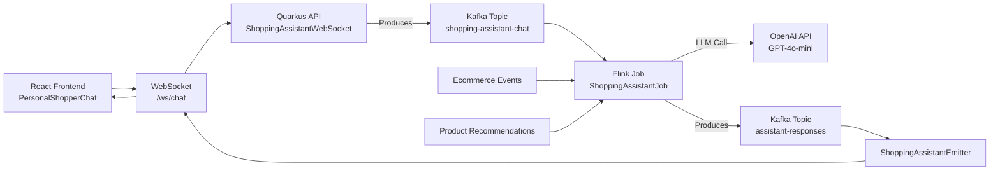

# Shopping Assistant - AI-Powered Chat Integration

## Overview

The Shopping Assistant is an AI-powered chatbot integrated into the KartShoppe e-commerce platform. It provides personalized shopping assistance, product recommendations, and real-time support using Apache Flink for stream processing and OpenAI's GPT models for natural language understanding.

## Architecture



## Components

### 1. Frontend (React)
**File**: `kartshoppe-frontend/src/components/PersonalShopperChat.tsx`

- Chat widget UI
- WebSocket connection to `/ws/chat`
- Sends user messages with basket context
- Displays AI responses and product recommendations

### 2. Quarkus WebSocket Endpoint
**File**: `quarkus-api/src/main/java/com/ververica/composable_job/quarkus/api/ShoppingAssistantWebSocket.java`

- WebSocket endpoint: `/ws/chat`
- Handles incoming messages from frontend
- Publishes to Kafka topic `shopping-assistant-chat`
- Manages session-to-connection mapping

### 3. Quarkus Response Consumer
**File**: `quarkus-api/src/main/java/com/ververica/composable_job/quarkus/api/ShoppingAssistantEmitter.java`

- Consumes from Kafka topic `assistant-responses`
- Routes responses to appropriate WebSocket connections
- Maintains connection registry

### 4. REST Fallback Endpoint
**File**: `quarkus-api/src/main/java/com/ververica/composable_job/quarkus/api/ShoppingAssistantResource.java`

- REST endpoint: `POST /api/chat/shopping-assistant`
- Fallback when WebSocket is not available
- Returns acknowledgment (async processing)

### 5. Flink Stream Processing Job
**File**: `flink-shopping-assistant/src/main/java/com/ververica/composable_job/flink/assistant/ShoppingAssistantJob.java`

Main job that:
- Reads chat messages from `shopping-assistant-chat` topic
- Enriches with basket context from `ecommerce-events`
- Maintains conversation history per session
- Calls OpenAI API asynchronously
- Publishes responses to `assistant-responses` and `websocket_fanout` topics

### 6. Supporting Classes

**Models**:
- `ChatMessage` - User chat message
- `EnrichedChatContext` - Message with basket and conversation history
- `AssistantResponse` - AI-generated response
- `BasketState` - Shopping cart state
- `ConversationState` - Chat history

**Operators**:
- `ChatContextEnricher` - CoProcessFunction that enriches messages with state
- `ShoppingAssistantAsyncFunction` - Async LLM integration
- `ShoppingAssistantService` - LangChain4j wrapper for OpenAI

## Message Flow

### 1. User Sends Message

**Frontend → WebSocket**:
```javascript
{
  type: "USER_MESSAGE",
  text: "What goes well with items in my cart?",
  sessionId: "session_123",
  userId: "user_456",
  context: {
    basketItems: 2,
    basketValue: 89.99,
    currentCategory: "electronics"
  }
}
```

### 2. WebSocket → Kafka

**Kafka Topic: `shopping-assistant-chat`**:
```json
{
  "messageId": "msg_789",
  "sessionId": "session_123",
  "userId": "user_456",
  "text": "What goes well with items in my cart?",
  "timestamp": 1234567890,
  "type": "USER_MESSAGE",
  "connectionId": "ws_conn_abc"
}
```

### 3. Flink Processing

- Reads message from Kafka
- Enriches with basket state (from `ecommerce-events`)
- Adds conversation history
- Builds context-aware prompt
- Calls OpenAI API asynchronously
- Generates response

### 4. Flink → Kafka

**Kafka Topic: `assistant-responses`**:
```json
{
  "messageId": "resp_xyz",
  "sessionId": "session_123",
  "responseText": "Based on your cart, I recommend...",
  "recommendedProducts": ["prod_1", "prod_2"],
  "timestamp": 1234567900
}
```

### 5. Kafka → WebSocket → Frontend

**WebSocket Message**:
```json
{
  "type": "ASSISTANT_RESPONSE",
  "id": "resp_xyz",
  "sessionId": "session_123",
  "text": "Based on your cart, I recommend...",
  "recommendedProducts": [
    {"productId": "prod_1", "name": "...", "price": 29.99}
  ],
  "timestamp": 1234567900
}
```

## Kafka Topics

| Topic | Purpose | Producer | Consumer |
|-------|---------|----------|----------|
| `shopping-assistant-chat` | User messages | Quarkus WebSocket | Flink Job |
| `assistant-responses` | AI responses | Flink Job | Quarkus Emitter |
| `ecommerce-events` | Basket updates | Quarkus API | Flink Job |
| `websocket_fanout` | Broadcast events | Flink Job | All WebSockets |

## Getting Started

### Prerequisites

- Java 17+
- Node.js 22+
- Docker & Docker Compose (for Kafka)
- OpenAI API Key
- Gradle

### Environment Setup

```bash
export OPENAI_API_KEY='your-openai-api-key-here'
```

### Quick Start (All Services)

```bash
./start-shopping-assistant-demo.sh
```

This will start:
1. Kafka (Redpanda) - `localhost:19092`
2. Shopping Assistant Flink Job
3. Quarkus API - `http://localhost:8080`
4. KartShoppe Frontend - `http://localhost:3000`

### Stop All Services

```bash
./stop-shopping-assistant-demo.sh
```

### Manual Start (Individual Components)

#### 1. Start Kafka
```bash
docker compose up -d redpanda
```

#### 2. Start Shopping Assistant Flink Job
```bash
export OPENAI_API_KEY='your-key'
./start-shopping-assistant.sh
```

Or manually:
```bash
./gradlew :flink-shopping-assistant:shadowJar
KAFKA_BOOTSTRAP_SERVERS=localhost:19092 \
java -cp flink-shopping-assistant/build/libs/flink-shopping-assistant-1.0.0-SNAPSHOT-all.jar \
  com.ververica.composable_job.flink.assistant.ShoppingAssistantJob \
  --kafka-brokers localhost:19092
```

#### 3. Start Quarkus API
```bash
cd quarkus-api
./gradlew quarkusDev
```

#### 4. Start Frontend
```bash
cd kartshoppe-frontend
npm install
npm run dev
```

## Testing the Integration

### 1. Open Frontend
Navigate to `http://localhost:3000`

### 2. Start Shopping
- Browse products
- Add items to cart

### 3. Open Chat Widget
Click the chat button in the bottom-right corner

### 4. Test Queries

**Basket Awareness**:
```
User: "What's in my cart?"
AI: Lists current cart items with prices
```

**Recommendations**:
```
User: "What goes well with these items?"
AI: Suggests complementary products
```

**Product Search**:
```
User: "Help me find wireless headphones"
AI: Suggests products and helps narrow down options
```

**General Help**:
```
User: "Any deals today?"
AI: Provides information about promotions
```

## Configuration

### Quarkus (application.properties)

```properties
# Shopping Assistant Topics
%dev.quarkus.kafka.devservices.topic-partitions.shopping-assistant-chat=3
%dev.quarkus.kafka.devservices.topic-partitions.assistant-responses=3

# Kafka Messaging
mp.messaging.outgoing.shopping-assistant-chat.topic=shopping-assistant-chat
mp.messaging.incoming.assistant-responses.topic=assistant-responses
```

### Flink Job

Topics configured in `ShoppingAssistantJob.java`:
- Input: `shopping-assistant-chat`, `ecommerce-events`
- Output: `assistant-responses`, `websocket_fanout`

## Troubleshooting

### WebSocket Not Connecting

1. Check Quarkus is running: `http://localhost:8080/q/health`
2. Check WebSocket endpoint: `ws://localhost:8080/ws/chat`
3. Check browser console for errors

### No AI Responses

1. Verify OPENAI_API_KEY is set
2. Check Flink job logs: `tail -f logs/shopping-assistant.log`
3. Verify Kafka topics exist:
   ```bash
   docker exec redpanda-1 rpk topic list
   ```

### Kafka Connection Issues

1. Check Redpanda is running:
   ```bash
   docker ps | grep redpanda
   ```
2. Check cluster info:
   ```bash
   docker exec redpanda-1 rpk cluster info
   ```

### Check Topic Messages

View messages in topics:
```bash
# User messages
docker exec redpanda-1 rpk topic consume shopping-assistant-chat

# AI responses
docker exec redpanda-1 rpk topic consume assistant-responses
```

## Development

### Building

```bash
# Build Flink job
./gradlew :flink-shopping-assistant:shadowJar

# Build Quarkus
cd quarkus-api
./gradlew build

# Build Frontend
cd kartshoppe-frontend
npm run build
```

### Testing Locally

1. Start Kafka
2. Start Flink job with test data
3. Send test messages via curl:

```bash
curl -X POST http://localhost:8080/api/chat/shopping-assistant \
  -H "Content-Type: application/json" \
  -d '{
    "message": "Hello!",
    "sessionId": "test-session",
    "userId": "test-user",
    "basket": []
  }'
```

## Features

### Context-Aware Responses
- Knows what's in your cart
- Remembers conversation history (last 10 messages)
- Understands your shopping intent

### Real-Time Updates
- Basket changes automatically update context
- Product views tracked
- Live recommendations

### Smart Intent Detection
- RECOMMENDATION - Product suggestions
- CART_INQUIRY - Cart-related questions
- PRICE_INQUIRY - Pricing questions
- PRODUCT_SEARCH - Finding products
- HELP - General assistance
- GENERAL - Other queries

### Async Processing
- Non-blocking LLM calls
- Retry strategy with exponential backoff
- Timeout handling

## Monitoring

### Logs

```bash
# Flink job
tail -f logs/shopping-assistant.log

# Quarkus
tail -f quarkus-api/logs/application.log
```

### Metrics

Available at:
- Quarkus metrics: `http://localhost:8080/q/metrics`
- Health check: `http://localhost:8080/q/health`

## Production Considerations

1. **Rate Limiting**: Implement rate limiting for LLM API calls
2. **Caching**: Cache common responses
3. **Fallback**: Provide static responses when LLM is unavailable
4. **Security**: Authenticate users, validate inputs
5. **Monitoring**: Track response times, error rates
6. **Scaling**: Increase Flink parallelism, add more Kafka partitions

## License

MIT - Training and demonstration project
